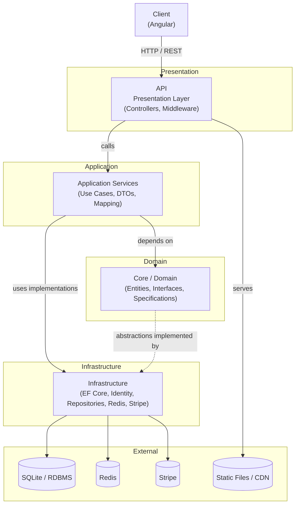

# E-commerce Application — Backend Architecture & Design Patterns

This document explains the backend architecture used in this repository (Server/API, Server/Core, Server/Infrastructure), the main design patterns applied, and the request processing flow.

The backend follows a layered / clean architecture approach with explicit separation of concerns:

## Clean Architecture Diagram

Below is a visual representation of the Clean (Layered) Architecture used by the backend.

### Mermaid diagram (rendered on platforms that support Mermaid)

### ASCII fallback (if Mermaid is not rendered)

Client (Angular)
  |
  v
+-------------------------------+
| Presentation (API)            |
| - Controllers                 |
| - Middleware (JWT, Errors)    |
+-------------------------------+
  |
  v
+-------------------------------+
| Application / Services        |
| - Use Cases                   |
| - DTOs / Mapping (AutoMapper) |
+-------------------------------+
  |
  v
+-------------------------------+
| Domain (Core)                 |
| - Entities                    |
| - Interfaces (Repositories)   |
| - Specifications              |
+-------------------------------+
  |
  v
+-------------------------------+
| Infrastructure                |
| - EF Core / DbContexts        |
| - Identity                    |
| - Redis, Stripe integrations  |
| - Repositories (implementation)|
+-------------------------------+
  |
  v
External: SQLite / RDBMS, Redis, Stripe, Static Files/CDN

---

## Architecture summary (conceptual)
The backend follows a layered / clean architecture approach with explicit separation of concerns:

- Presentation layer: Server/API
  - Web API controllers, middleware, swagger, static file hosting, program startup (Program.cs).
- Domain layer: Server/Core
  - Domain entities, repository interfaces, specifications, and pure business rules.
- Infrastructure layer: Server/Infrastructure
  - Implementations for persistence (EF Core / DbContexts), Identity, cache (Redis), third-party integrations (Stripe), repositories, services.

The API project references Infrastructure; Infrastructure references Core. This keeps business logic and contracts (Core) independent of implementation details.

## Primary design patterns used

1. Clean / Layered Architecture
   - Purpose: separate concerns (API, domain, infrastructure) so the domain is independent of frameworks and infrastructure.
   - How it shows: `Core` contains interfaces and entities; `Infrastructure` implements them and is referenced by `API`.

2. Dependency Injection (DI)
   - Purpose: decouple components and make them testable.
   - How it shows: Services and repositories are registered inside `Program.cs` through extension methods (`AddApplicationServices`, `AddIdentityServices`) and injected into controllers and services.

3. Repository Pattern
   - Purpose: abstract data access behind interfaces so domain code does not depend on EF Core directly.
   - How it shows: Interfaces for repositories exist in Core and concrete repository implementations live in Infrastructure.

4. Specification Pattern
   - Purpose: encapsulate query logic as reusable specifications.
   - How it shows: Project contains a `Specification` folder inside `Core` for query/filter specifications used by repositories.

5. Middleware Pattern
   - Purpose: centralize cross-cutting concerns (authentication, error handling, logging).
   - How it shows:
     - `JwtMiddleware` — custom JWT extraction/validation and attaching user context.
     - `ExceptionMiddleware` — centralized exception handling and consistent error responses.
     - These are wired in `Program.cs`.

6. DTO / Mapping Pattern (Anti-corruption layer for input/output)
   - Purpose: prevent leaking domain entities to the outside; map domain entities to DTOs for API responses.
   - How it shows: `Dtos` folder in API and AutoMapper referenced in API.csproj.

7. Configuration & Secrets Management (recommended pattern)
   - Purpose: keep configuration separate from code; use environment variables for secrets.
   - How it shows: `appsettings.json` and `appsettings.Development.json` are used for configuration. (Note: current repo contains secrets in appsettings — move to env vars or secret stores for production.)

8. Seeding & Migration Strategy
   - Purpose: ensure DB schema and seed data are available on startup during development.
   - How it shows: `Program.cs` runs `context.Database.MigrateAsync()` and seeders (`StoreContextSheed.SeedAsync`, `AppIdentityDBContextSeed.SeedUsersAsync`) at startup.

## Request processing flow (step-by-step)

1. Client -> HTTP request (Kestrel)
2. Incoming request reaches the middleware pipeline (configured in `Server/API/Program.cs`):
   - Static files handling
   - `JwtMiddleware` — extracts token, validates it (attaches user context)
   - `ExceptionMiddleware` — catches unhandled exceptions and returns structured errors
   - Status code pages / redirects
   - CORS policy
   - Authentication + Authorization middleware
3. Controller execution (API layer)
   - Controllers read DTOs from request, validate inputs (ModelState).
   - Controllers call application services or repository interfaces (defined in `Core`) that are implemented in `Infrastructure`.
4. Domain logic (Core + service layer)
   - Business rules executed (domain entities, validations, specs).
   - Repositories fetch/persist data. Query logic may be expressed as Specification objects passed to repositories.
5. Infrastructure layer interactions
   - EF Core DbContext performs database operations (StoreContext, AppIdentityDbContext).
   - Redis (StackExchange.Redis) used for caching where implemented.
   - Stripe SDK used for payments and webhooks; webhooks validated with `WhSecret` from configuration.
6. Response returns to controller, is mapped to DTO and sent back to client.
7. Global middleware (ExceptionMiddleware) formats any errors consistently.

## Project structure (quick map)
- `Server/API` — Presentation (Controllers, Middleware, Program.cs)
- `Server/Core` — Domain (Entities, Interfaces, Specifications)
- `Server/Infrastructure` — Implementations (EF Core, Identity, Repositories, Services)
- `Client/ecommerceClint` — Angular application

## Practical notes / suggestions
- Move secrets out of `appsettings.json` to environment variables or a secret manager.
- For production, replace SQLite with a production-grade DB and host static files in a shared store or CDN.
- Use Redis when running multiple API instances (for distributed caching).
- Add integration tests for payment/webhook and auth flows.
- Consider adding health/readiness endpoints if deploying to container orchestrators.
